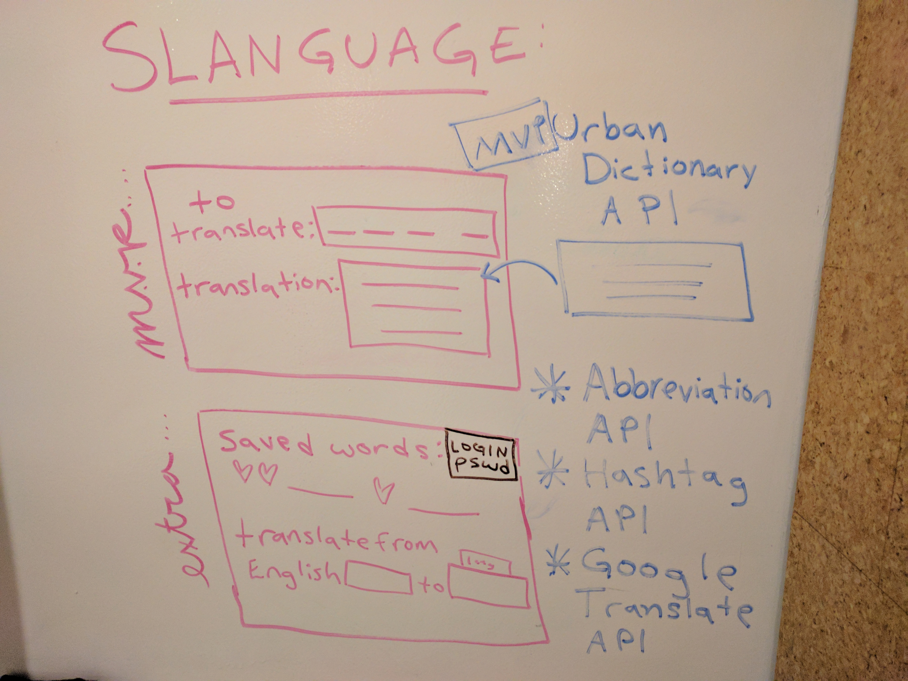
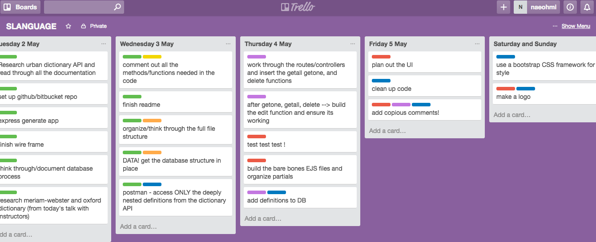
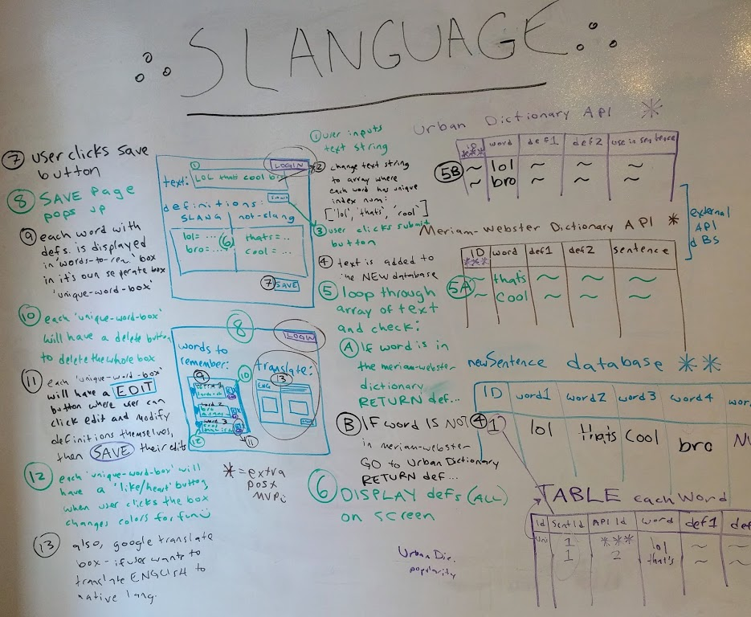

# Project 2 (SLANGUAGE)
-----------------------

An app to help people learn English slang, to communicate effectively with native English speakers.

(live at: https://slanguage2.herokuapp.com/)

## Wireframes and Project Management 
----------

## User Stories
------------
As a user, I want to send text messages to my friends who speak English as a native/first language. I want to understand their slang and use it appropriately. As a user, I want to input a text message and immediately see a definition of the slang words, abbreviations, and/or hashtags used. I want to save the word and accompanying definitions to use again later, when I'm studying my English. I want to edit the definitions to make them uniquely tailored to me and save those edits for future use. As a user I would like to have the option of translating the English definitions into my native language, so I can thoroughly understand the concept. 

## Pseudocode and visual representation of database
----------

## Technologies used
-----------
* Node.js (including: nodemon, bluebird, pg-promises, and more!)
* Express.js
* PostgreSQL
* JavaScript
* jQuery
* HTML
* CSS
* and more...

## Download Project & Install
----------------

1. [Git clone or download this project]
2. Create a PostgreSQL database called 'slanguage2'
3. On your terminal, navigate to the models folder and run `psql  -f slanguage2.sql`
4. Make sure to npm install nodemon --save
5. Run nodemon, and app should be available on localhost:3000

## Live Heroku Deployment at https://slanguage2.herokuapp.com/

